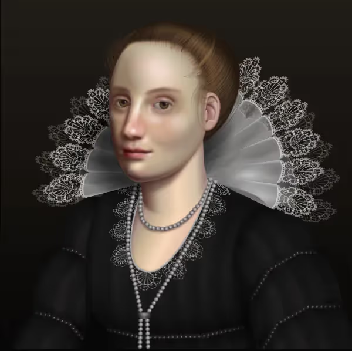

# The How and Why of Stunning CSS Art (with Examples)

Ever heard of CSS art? It’s a fun and creative way to show off your chops as a designer while creating something unique and beautiful.

Today, we’ll show you some of the most impressive examples of CSS art you’ll find on the web, plus break down the techniques the designers used to create their images.

We’ll wrap up by walking you through a basic process you can use to create your own CSS masterpiece.

Are you a future CSS artist? Let’s find out!

---

## What is CSS art?

CSS art is a digital image created with Cascading Style Sheet (CSS) code instead of a design tool. Usually, CSS art will only use an HTML and a CSS file — no illustrations, images, or JavaScript to speak of.

While you see CSS designs on almost every modern website, CSS art goes beyond basic layout, background, and text formatting. Instead, it’s a visual technique that pushes the boundaries of what stylesheets can do.

That said, you won’t find CSS art on most websites. Instead, this creative artwork is mostly a side project for those with a web development career.

---

## Five stunning CSS art examples

Below are screenshots (from Chrome) of some impressive CSS art pieces.

### Cassette Tape

This cassette tape might look like a simple drawing until you realize it's made from a single `div` element.

---

### Smartphone

This photorealistic smartphone is neither a photo nor a 3D render — it's pure HTML and CSS.

---

### The Mona Lisa

The iconic portrait by Leonardo da Vinci recreated entirely using CSS.

---

### Southwold Landscape

A stunning CSS landscape that allows editable sunset colors for endless variations.

---

### Baroque Portrait

A portrait inspired by Flemish baroque oil paintings, built entirely with CSS.

---

## Why do designers code CSS art?

A CSS illustration is usually worse for performance than a standard image.

The issue isn’t file size — it’s render speed. Browsers must calculate every shape, gradient, and shadow, which can be slower than displaying a static image.

So CSS art is usually a **side project**, not a production asset.

Why do it anyway?

- It’s a creative challenge
- It shows *deep* CSS mastery
- It’s a portfolio flex
- It attracts attention and opportunities

---

## How is CSS art made?

Despite how complex it looks, CSS art is built from many simple pieces.

### Shapes
- Built using `div`s and pseudo-elements (`::before`, `::after`)
- Controlled with `border-radius` and `clip-path`

### Gradients
- Used for lighting, depth, reflections, and skin tones
- Linear gradients for straight blends
- Radial gradients for circular effects

### Shadows
- `box-shadow` can be stacked hundreds or thousands of times
- One element can generate massive complexity

---

## How to get started with CSS art

1. Pick a simple subject
2. Break it into basic shapes
3. Minimize HTML elements
4. Use pseudo-elements, shadows, and gradients
5. Add detail and polish

That’s it. Build, tweak, repeat.

---

## Going beyond CSS art

CSS art is a great way to stretch your skills, but you don’t need to master it to build great websites.

Even without art-level complexity, CSS is one of the most powerful tools in web development. If you’re serious about front-end, learning CSS deeply is non-negotiable.
